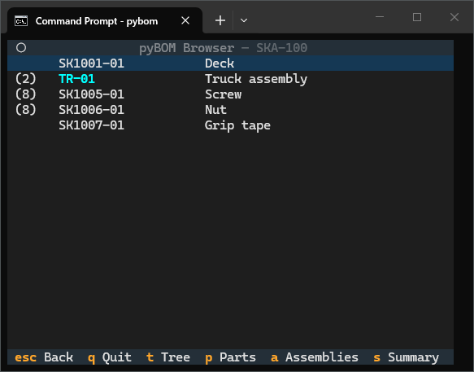

# bomkit


A Python program for flattening a layered bill-of-material (BOM) based on Excel
files. Part quantities are combined and a total quantity or
minimum-required-package-to-buy amount is calculated, in addition to extended
costs. A tree structure of the BOM hierarchy can also be created and converted
to DOT syntax for further graphics generation.

The functionality can be accessed in three ways:

| Method | Description |
|--------|-------------|
| Interactive TUI (terminal-based interface) | Launch with `bomkit [directory]` |
| API | In Python, use `from bomkit import BOM`, then `BOM.from_folder()` or `BOM.single_file()` |
| Command line | Run with `bomkit [-h] (-f FILE \| -d FOLDER) action` |


## Motivation

The main problem solved is to combine identical parts from various
sub-assemblies and locations in your product BOM. Additionally, it is designed
to be used with Excel since Excel is common and does not require a separate
program or server.

Flattening tells you the total QTY of a part when it may be used in many
sub-assemblies and levels in your product structure. This is necessary to
calculate the total QTY of a part and therefore determine the mininum packages
of the product to buy, since many parts come in packs greater than QTY 1.

## Structure

There are two methods for storing data for parts and assemblies: multi-file or
single file.

### Multi-File

In a separate directory, put an Excel file named *Parts List.xlsx* to serve as
the master parts list \"database\". Then, each additional assembly is described
by a separate .xlsx file. Thus you might have:

    my_project/
       Parts list.xlsx     <-- master parts list
       SKA-100.xlsx        <-- top level/root assembly
       TR-01.xlsx          <-- subassembly
       WH-01.xlsx          <-- subassembly

Root and sub-assemblies are inferred from item number relationships and are not
required to be explicitly identified.

*Parts list.xlsx* serves as the single point of reference for part information.
For example, it may have the following:

| PN        | Name        | Description                    | Supplier               | Supplier PN   | Pkg QTY   | Pkg Price  |
| --------- | ----------- | ------------------------------ | ---------------------- | ------------- | --------- | ---------- |
| SK1001-01 | Deck        | Pavement Pro 9" Maple Deck     | Grindstone Supply Co.  | BRX-02        | 1         | 67.95      |
| SK1002-01 | Truck       | HollowKing Standard Trucks     | Grindstone Supply Co.  | TR1-A         | 1         | 28.95      |
| SK1003-01 | Bearing     | ABEC-7 Steel Bearings          | BoltRun Hardware       | 74295-942     | 1         | 9.95       |
| SK1004-01 | Wheel       | SlickCore 54mm Cruiser Wheels  | Grindstone Supply Co.  | WHL-PRX       | 4         | 44.95      |
| SK1005-01 | Screw       | 10-32, 1", Phillips            | BoltRun Hardware       | 92220A        | 25        | 12.49      |
| SK1006-01 | Nut         | 10-32                          | BoltRun Hardware       | 95479A        | 25        | 9.89       |
| SK1007-01 | Grip Tape   | SuperStick 9"                  | BoltRun Hardware       | GTSS99        | 1         | 8.95       |

For each assembly, all that is required is the part identification number and
quantity which correspond to the following fields:

- PN
- QTY

Example wheel assembly (1 wheel + 2 bearings):

| PN          | QTY   |
| ----------- | ----- |
| SK1004-01   | 1     |
| SK1003-01   | 2     |

Certain fields are used in calculating totals, such as in `BOM.BOM.summary`,
which are:

`Pkg QTY`
  : The quantity of items in a specific supplier SKU (i.e. a bag of 100 screws)

`Pkg Price`
  : The cost of a specific supplier SKU                                        


### Single File

A single Excel file is used to store all part and assembly data through the use
of Excel tabs.

The conventions for the single file approach are the same as the multi-file
approach, with the following exceptions:

- The first (left-most) Excel tab is treated as the Parts List "database",
  regardless of its name
- All tabs/sheets to the right are interpreted as assemblies, with the sheet
  name as the assembly part number (PN)


## Usage

Install with pip via `pip install .`    <!-- TODO: add PyPI link when published -->

Set up your data with either the multi-file or single file approach.

### TUI Browser

In a terminal, browse to the folder containing your BOM files and issue the
command `bomkit` with no arguments (or issue the path to your directiry, e.g.
`bomkit /path/to/your/project`). This will cause it to enter the browser mode
where you can interact with your BOM hierarchy and view derived properties such
as the aggregated parts list and tree structure.

The default screen shows the top-level assembly and its direct-child parts and
assemblies. You can navigate down the hierarchy with the ⬆️ and ⬇️ arrow keys
and by selecting an assembly and pressing `Enter` to view its child parts and
assemblies. Pressing `Enter` on a part will show its details. Use the left arrow
key ⬅️ or `Esc` to return to the parent assembly. You can also access different
views and derived properties using the command keys listed at the bottom of the
screen, such as `t` for a tree view. Assemblies are shown in cyan and bold text.
The top row shows a breadcrumb of the current location in the BOM hierarchy.

The commands at the bottom of the screen are:

- `t` for a tree view of the full BOM hierarchy
- `p` for a part list view (all the parts in the Parts List file
- `a` for a list of all the assemblies in the BOM
- `s` for a summary view (aggregated parts list with total QTY and purchase
  QTY)




### API Usage

```python
from bomkit import BOM

# Multi-file
bom = BOM.from_folder(FOLDER)

# Single file
bom = BOM.single_file(FILENAME)
```

This returns a `BOM` object with properties on it you can retrieve:


`BOM.parts`
  : Get a list of all direct-child parts

  ```
  >>> print(bom.parts)
  [Part SK1001-01, Part SK1005-01, Part SK1006-01, Part SK1007-01] 
  ```

`BOM.assemblies`
  : Get a list of all direct-child assemblies

  ```
  >>> print(bom.assemblies)
  [TR-01]
  ```

`BOM.aggregate`
  : Get the aggregated quantity of each part/assembly from the current
  BOM level down

  ```
  >>> print(bom.aggregate)
  {'SK1001-01': 1, 'SK1005-01': 8, 'SK1006-01': 8, 'SK1007-01': 1, 'SK1002-01': 2, 'SK1004-01': 4, 'SK1003-01': 8}
  ```

`BOM.summary`
  : Get a summary in the form of a DataFrame containing the master parts
  list with each item's aggregated quantity and the required packages
  to buy (`Purchase QTY`) if the `Pkg QTY` field is not 1.

  ```
  >>> print(bom.summary)
          PN       Name                    Description  ... Total QTY Purchase QTY  Subtotal
0  SK1001-01       Deck     Pavement Pro 9" Maple Deck  ...         1            1     67.95
1  SK1002-01      Truck     HollowKing Standard Trucks  ...         2            2     57.90
2  SK1003-01    Bearing          ABEC-7 Steel Bearings  ...         8            8     27.92
3  SK1004-01      Wheel  SlickCore 54mm Cruiser Wheels  ...         4            1     44.95
4  SK1005-01      Screw            10-32, 1”, Phillips  ...         8            1     12.49
5  SK1006-01        Nut                          10-32  ...         8            1      9.89
6  SK1007-01  Grip tape                  SuperStick 9”  ...         1            1      8.95
  ```

`BOM.tree`
  : Return a string representation of the BOM tree hierarchy

  ```
  >>> print(bom.tree)
  SKA-100
  ├── Part SK1001-01        
  ├── TR-01
  │   ├── Part SK1002-01    
  │   └── WH-01
  │       ├── Part SK1004-01
  │       └── Part SK1003-01
  ├── Part SK1005-01        
  ├── Part SK1006-01        
  └── Part SK1007-01  
  ```

  Calling this on child assemblies shows the tree from that reference point:
  ```
  >>> bom.assemblies
  [TR-01]
  >>> print(bom.assemblies[0].tree)
  TR-01
  ├── Part SK1002-01
  └── WH-01
    ├── Part SK1004-01
    └── Part SK1003-01
  ```

### Command Line Usage

Functionality is extended to the command line where the flags `-f` and `-d` are
used to specify the name of a file for single-file mode or a folder for
multi-file mode, respectively.

`action` is what to do with the imported data, which just maps to a property
on the top-level `BOM` object.

This method is not persistent and is meant for quick one-off retrieval of information.

```
> bomkit [-h] (-f FILE | -d FOLDER) action
```

```
> bomkit -d Example tree
SKA-100
├── Part SK1001-01        
├── TR-01
│   ├── Part SK1002-01    
│   └── WH-01
│       ├── Part SK1004-01
│       └── Part SK1003-01
├── Part SK1005-01        
├── Part SK1006-01        
└── Part SK1007-01 
```

Dependencies
------------

- *pandas*
- *anytree*
- *openpyxl*
- *textual*